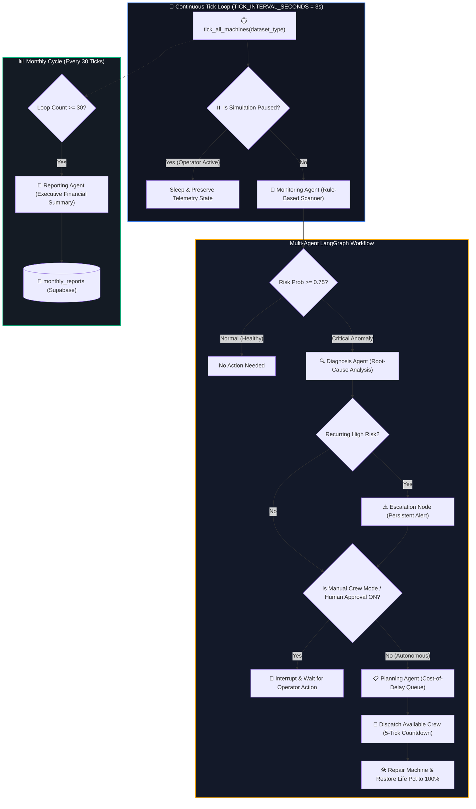
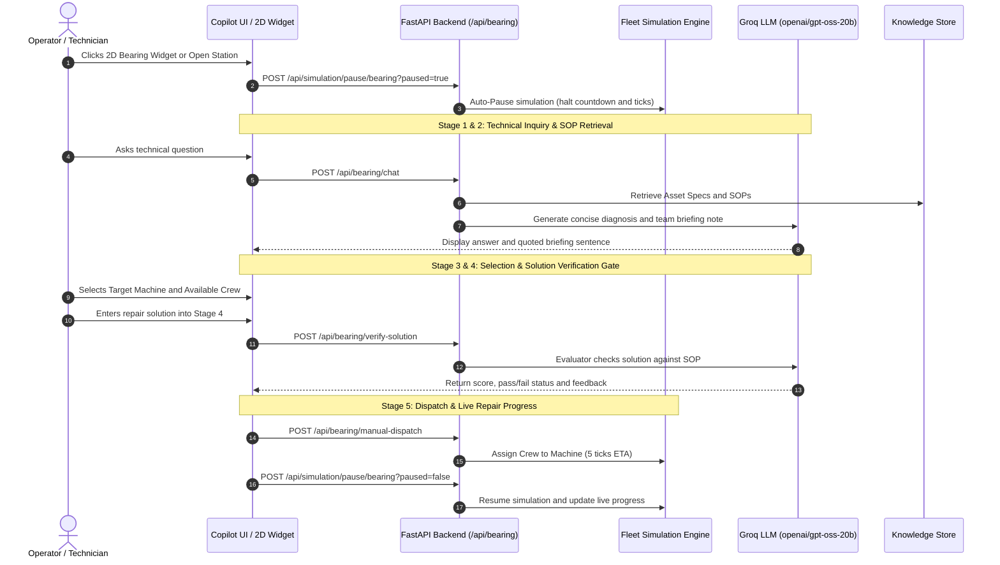
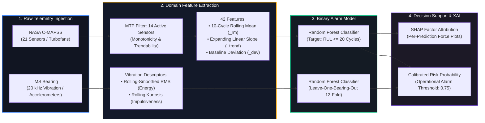

# Predictive Maintenance Platform & Industrial AI Copilot
### NASA C-MAPSS (Turbofan Engines) & IMS Rexnord Bearing Datasets

**Live Demo:** [https://predictive-maintenance-dashboard-git-main-eren25.vercel.app](https://predictive-maintenance-dashboard-git-main-eren25.vercel.app)

An end-to-end, explainable predictive maintenance platform, multi-agent fleet simulation engine, and Groq-powered Industrial AI Copilot built on NASA's C-MAPSS turbofan engine dataset and the IMS Bearing dataset — designed around one non-negotiable principle: **never claim more certainty than the data actually supports.**

---

## 📑 Table of Contents
- [Platform Architecture](#-platform-architecture)
- [Key Features & Modules](#-key-features--modules)
  - [1. Multi-Agent Fleet Simulation (LangGraph)](#1-multi-agent-fleet-simulation-langgraph)
  - [2. Industrial Bearing AI Copilot & Knowledge RAG](#2-industrial-bearing-ai-copilot--knowledge-rag)
  - [3. 2D Top-Down Bearing Siri-Style Chatbot Widget](#3-2d-top-down-bearing-siri-style-chatbot-widget)
  - [4. Interactive 3D Digital Twins (Three.js)](#4-interactive-3d-digital-twins-threejs)
  - [5. Live Stream & SHAP Explainability Engine](#5-live-stream--shap-explainability-engine)
  - [6. Synthetic Data & Parametric Bootstrap Layer](#6-synthetic-data--parametric-bootstrap-layer)
  - [7. Business Value & Economic Cost-Benefit Model](#7-business-value--economic-cost-benefit-model)
- [Machine Learning Methodology & Dataset Deep-Dive](#-machine-learning-methodology--dataset-deep-dive)
  - [Why a Binary Classification Alarm System?](#why-a-binary-classification-alarm-system)
  - [NASA C-MAPSS (FD001 Turbofans)](#nasa-c-mapss-fd001-turbofans)
  - [IMS Rexnord Bearing Dataset](#ims-rexnord-bearing-dataset)
  - [Discarded Approaches & Negative Results](#discarded-approaches--negative-results)
- [The Core Finding (Honest Validation)](#-the-core-finding-honest-validation)
- [Literature Synthesis & Academic Foundations](#-literature-synthesis--academic-foundations)
- [Tech Stack](#-tech-stack)
- [Local Development Setup](#-local-development-setup)
- [License](#-license)

---

## 🏛️ Platform Architecture

```
                  ┌──────────────────────────────────────────────────────────────┐
                  │                   FRONTEND (React 18 + Vite)                 │
                  │  • Interactive 3D Digital Twins (Three.js WebGL)             │
                  │  • Live Telemetry Stream & SHAP Factor Attribution           │
                  │  • 2D Top-Down Bearing Siri-Style Chatbot Widget             │
                  │  • 5-Stage Operator Intervention Station (Modal)             │
                  │  • Parametric Bootstrap Degradation Envelope Charts          │
                  │  • Full TR / EN Context-Aware Localization                   │
                  └──────────────────────────────┬───────────────────────────────┘
                                                 │
                                                 ▼
                  ┌──────────────────────────────────────────────────────────────┐
                  │                 BACKEND (FastAPI + LangGraph)                │
                  │  • Multi-Agent Autonomous Fleet Simulation StateGraph        │
                  │  • Groq LLM (openai/gpt-oss-20b) Domain RAG Engine           │
                  │  • Operator Solution SOP Evaluator (0-100 Scoring Gate)      │
                  │  • Simulation Auto-Pause & Resume Synchronization Engine     │
                  │  • Manual Crew Dispatch Mode & Human-in-the-Loop Gate        │
                  └──────────────────────────────┬───────────────────────────────┘
                                                 │
                                                 ▼
                  ┌──────────────────────────────────────────────────────────────┐
                  │                    DATA & KNOWLEDGE STORE                    │
                  │  • Supabase (PostgreSQL Realtime State Synchronization)      │
                  │  • 12 Industrial Bearing Asset Specifications (M01-M12)      │
                  │  • 30+ Fault Modes & Standard Operating Procedures (SOP)     │
                  │  • Historical Maintenance Work Orders & Technical Manual     │
                  └──────────────────────────────────────────────────────────────┘
```

---

## 🌟 Key Features & Modules

### 1. Multi-Agent Fleet Simulation (LangGraph)
A live, tick-driven simulation running a 12-unit industrial fleet continuously in the background. Each machine degrades independently based on empirical statistical patterns:



- **Monitoring Agent:** Ultra-fast rule-based scanner checking wear and vibration thresholds without LLM latency.
- **Diagnosis Agent:** Natural-language root-cause analyzer reviewing current telemetry and multi-tick history to identify persistent or escalating anomalies.
- **Planning Agent:** Cost-of-delay priority queuing algorithm managing maintenance crew dispatching and backlog.
- **Reporting Agent:** Synthesizes monthly financial and operational executive summaries.
- **Human-in-the-Loop Approval Manager:** Pauses execution when an anomaly is flagged, requiring operator authorization before dispatching crews.
- **Manual Crew Mode:** Suspends autonomous dispatches and transfers full control to the human operator.

### 2. Industrial Bearing AI Copilot & Knowledge RAG
Mounted natively on `/api/bearing` and powered by Groq's high-speed inference (`openai/gpt-oss-20b` with `reasoning_effort="low"`):



- **Deterministic Domain Knowledge Store (`data/bearing_knowledge/`):**
  - `bearing_assets.json`: 12 bearing asset records (SKF, FAG, NSK, Timken models, RPM, BPFI/BPFO/BSF/FTF multipliers, lubrication specs).
  - `bearing_fault_catalog.json`: 30+ failure modes with spectral signatures, Kurtosis/RMS thresholds, root causes, and official SOPs.
  - `bearing_maintenance_history.json`: Historical maintenance records and past work orders.
  - `bearing_technical_manual.md`: Engineering manual with kinematic equations, ISO 10816-3 severity tables, and lubrication calculations.
- **5-Stage Operator Intervention Station:**
  1. **Fault Alert & Asset Parameters:** Shows telemetry, vibration levels, and fault zone.
  2. **AI Engineering Chatbot:** Delivers concise 3-part diagnostic summaries and actionable team briefing notes.
  3. **Machine & Crew Selection:** Dual-column asset and available crew selector.
  4. **Solution Verification Gate:** The operator inputs proposed repair steps; an AI Evaluator validates against official SOPs and assigns a 0-100 score.
  5. **Live Dispatch & Repair Accordion:** Collapsible real-time progress tracker with problem/solution logs.
- **Auto-Pause Simulation:** Automatically halts machine degradation while the operator investigates and resumes upon completion.

### 3. 2D Top-Down Bearing Siri-Style Chatbot Widget
- Custom-designed 2D top-down bearing SVG icon with metallic neon styling and hover tooltip.
- Slides up a mobile phone-style chat drawer.
- **Shared Chat State:** Real-time synchronization between the floating widget and Stage 2 of the Copilot Modal via `BearingChatContext`.

### 4. Interactive 3D Digital Twins (Three.js)
- Real-time 3D rendered models for both Jet Engine (C-MAPSS) and Rolling Bearing.
- Dynamic component-level fault illumination (Inner Race, Outer Race, Roller Elements, HPC/LPT degradation).

### 5. Live Stream & SHAP Explainability Engine
- Live telemetry stream visualizing sensor degradation in real time.
- **SHAP (SHapley Additive exPlanations):** Real-time feature attribution decomposing each prediction into individual sensor contributions, answering *why* a unit is flagged.

### 6. Synthetic Data & Parametric Bootstrap Layer
- Demonstrates how synthetic streams are generated using empirical mean and standard deviation degradation envelopes from real run-to-failure experiments.
- **Natural Variability:** Preserves the natural +/- 1 standard deviation band so simulated streams reflect physical bearing-to-bearing differences.
- **Strict Boundary:** The synthetic stream is used solely to power the live interactive UI; it is **never used to train or report performance for ML models**.

### 7. Business Value & Economic Cost-Benefit Model
- Translates classification confusion matrices into financial Expected Value (EV) comparisons:
  - **Reactive Maintenance:** Run-to-failure incurring catastrophic downtime, secondary damage, and emergency repair costs.
  - **Preventive Maintenance:** Fixed-interval overhauls incurring unnecessary parts replacement and lost operating life.
  - **Predictive Maintenance:** Early-catch planned repairs minimizing downtime and maximizing component utilization.

---

## 🔬 Machine Learning Methodology & Dataset Deep-Dive



### Why a Binary Classification Alarm System?
In predictive maintenance literature, Remaining Useful Life (RUL) is frequently framed as a continuous regression problem. However, on small run-to-failure datasets:
1. Continuous RUL regression predictions oscillate wildly in early and mid-life, providing uncalibrated, noisy estimates that confuse maintenance planning.
2. In real-world industrial operations, maintenance managers do not need a floating decimal RUL; they need a **binary operational trigger**: *“Has this unit entered its critical wear phase requiring scheduled service within the next operational window?”*
3. Framing the task as an **Early-Warning Binary Classification Alarm System (RUL ≤ 20 cycles for C-MAPSS, late-stage wear boundary for Bearings)** produces well-calibrated, high-precision decision support.

### NASA C-MAPSS (FD001 Turbofans)
- **Data Scope:** 100 training engines (run-to-failure) and 100 test engines (truncated before failure), single sea-level operating condition, single fault mode (High-Pressure Compressor degradation).
- **Sensor Selection via MTP:** 14 active sensors selected out of 21 based on Monotonicity and Trendability (filtering out flat/noisy channels like T2, P2, P15, epr, farB, Nf_dmd, PCNfR_dmd).
- **Feature Engineering:**
  - `_rm`: 10-cycle rolling mean (smooths short-term measurement noise).
  - `_trend`: Expanding-window linear slope (captures long-term rate of degradation).
  - `_dev`: Baseline deviation (measures divergence from early-life nominal baseline).
  - 42 engineered features feeding a Random Forest Classifier.
- **Leak-Proof Evaluation:** Strict unit-based train/validation splitting. NASA's official test set is kept completely disjoint.

### IMS Rexnord Bearing Dataset
- **Data Scope:** 3 test-to-failure experiments (12 physical bearings total) conducted by the NSF I/UCRC Center for Intelligent Maintenance Systems (IMS). Rexnord ZA-2115 double-row bearings running at 2000 RPM under a 6000 lb radial load with ~20 kHz vibration sampling.
- **Feature Engineering:**
  - **RMS (Root Mean Square):** Rolling-smoothed over 20 files, normalized to early-life baseline to capture overall vibration energy.
  - **Kurtosis:** 4th statistical moment capturing the impulsiveness and sharpness of rolling element impact spikes before energy spreads across the spectrum.
- **Leave-One-Bearing-Out (LOBO) Cross-Validation:** Strict 12-fold cross-validation where each bearing is evaluated as a completely held-out physical unit, never trained on itself.

### Discarded Approaches & Negative Results
During engineering, several popular approaches were rigorously tested and discarded due to negative findings:
- ❌ **Automated Feature Explosion (tsfresh):** Generated 1000+ statistical features, causing extreme overfitting on small unit samples (n=100 / n=12).
- ❌ **Continuous RUL Regression:** Suffered from high variance in early-life cycles, producing misleadingly confident numbers.
- ❌ **GMM-HMM (Gaussian Mixture Hidden Markov Models):** Unregularized transition parameters swung into unstable states when trained on small fleets.

---

## 📉 The Core Finding (Honest Validation)

Most published papers on C-MAPSS and IMS Bearings report strong-looking accuracy metrics (e.g. RMSE < 15, Accuracy > 95%) — but almost always measured **retrospectively**: evaluating how well the model describes a unit's state when given its full observed lifespan.

When we evaluated the C-MAPSS model under **genuine early-life conditions (fixed cutoff horizons)**, a stark physical limitation emerged:

| Evaluation Horizon | Recall | Precision | Interpretation |
|---|---|---|---|
| NASA Official Test Set (truncated at NASA's late-stage cutoffs) | **0.938** | **0.962** | Excellent late-stage detection |
| Fixed cutoff at 20% of average lifespan | 0.000 | - | Signal indistinguishable from baseline noise |
| Fixed cutoff at 40% of average lifespan | 0.000 | - | No detectable degradation signature |
| Fixed cutoff at 60% of average lifespan | 0.000 | - | Early wear remains subsurface |
| Fixed cutoff at 80% of average lifespan | 0.206 | 1.000 | Only fastest-degrading units trigger alert |
| Fixed cutoff at 100% of average lifespan | 0.213 | 1.000 | Late-stage alarm reliable, early warning absent |

> **Conclusion:** Physical degradation in these machines does not emit linear early warnings. The model functions as a reliable **high-precision, late-stage trigger**, not a magical multi-month foresight tool. The platform visualizes and states this limitation transparently.

---

## 📚 Literature Synthesis & Academic Foundations

The platform's methodology builds upon a structured synthesis of 10 foundational papers in Prognostics and Health Management (PHM), compiled in the dashboard's **Literature Resources** page:

1. **Coble & Hines (2009) — Prognostic Parameter Selection (MTP Framework):** Established the tripartite distinction of *Monotonicity* (unidirectional trend), *Trendability* (shared curve shape across units), and *Prognosability* (identical spread at failure). Used for our sensor selection.
2. **Li et al. (2023) — RUL Estimation with Multi-Pattern Wiener Process:** Highlights that stochastic process models strictly depend on unidirectional degradation assumptions.
3. **Küçükdağ et al. (2026) — Robust HMM-Based RUL Estimation:** Demonstrated that standard statistical models suffer severe parameter instability on small fleets (n<100), proving regularization is essential.
4. **Airao et al. (2026, Wear 600) — Tool Wear & Uncertainty Quantification:** Showed that many literature claims of "uncertainty quantification" are post-hoc sensitivity analyses rather than true Bayesian posteriors.
5. **Wang, Yu, Siegel, Lee (2008) — Similarity-Based Prognostics:** Foundational PHM Challenge winner showing similarity approaches depend entirely on a rich, consistent historical trajectory library.
6. **Soons et al. (2020) — TBSP and Bayesian Updating:** Showed that Bayesian updating mechanisms cannot compensate for fundamentally weak or inconsistent underlying sensor signals.
7. **Li et al. (2025) — Mode-Dependent RVM + Similarity Ensemble:** Analyzed how mode-clustering techniques partition already small datasets into even smaller, fragile subsets.
8. **Yang, Ji, Li (2026) — Multi-Route Similarity Ensemble:** Showed that ensemble methods only succeed if component models have independent failure modes.
9. **Saxena et al. (2008) — NASA C-MAPSS Benchmark:** Foundational turbofan degradation simulation standard.
10. **Qiu et al. (2006) — Wavelet Filter-Based Weak Signature Detection:** Principles of isolating early acoustic emissions and vibration kurtosis from background mechanical noise.

---

## 💻 Tech Stack

- **AI & LLM Inference:** Groq Cloud API (`openai/gpt-oss-20b`, low reasoning latency)
- **Multi-Agent Orchestration:** LangGraph, StateGraph, Python 3.11
- **Machine Learning & XAI:** scikit-learn (Random Forest), SHAP (TreeExplainer), pandas, numpy
- **Backend API:** FastAPI, Uvicorn, REST + WebSocket streaming
- **Database & Sync:** Supabase (PostgreSQL Realtime)
- **Frontend UI:** React 18, Vite, Three.js / @react-three/fiber, Lucide Icons, Vanilla CSS
- **Localization:** Context-based English & Turkish (TR / EN) i18n
- **Hosting:** Render (Backend API), Vercel (Frontend Dashboard)

---

## 🚀 Local Development Setup

### 1. Prerequisites
- Python 3.10+
- Node.js 18+
- Groq API Key (and Supabase credentials)

### 2. Environment Configuration
Create a `.env` file in the root directory:
```env
GROQ_API_KEY=gsk_your_groq_api_key_here
SUPABASE_URL=https://your-project.supabase.co
SUPABASE_SERVICE_ROLE_KEY=your_service_role_key
```

### 3. Backend Setup
```bash
# Install Python dependencies
pip install fastapi uvicorn supabase langgraph langchain-core groq scikit-learn pandas numpy shap httpx

# Start the Fleet Simulation & Bearing Copilot API
uvicorn src.fleet-simulation-api.main:app --host 127.0.0.1 --port 8001 --reload
```

### 4. Frontend Setup
```bash
cd dashboard

# Install npm packages
npm install

# Start Vite dev server
npm run dev
```
Open [http://localhost:5173](http://localhost:5173) in your browser.

---

## 📜 License
MIT License. Developed for research, industrial AI prototyping, and predictive maintenance education.
